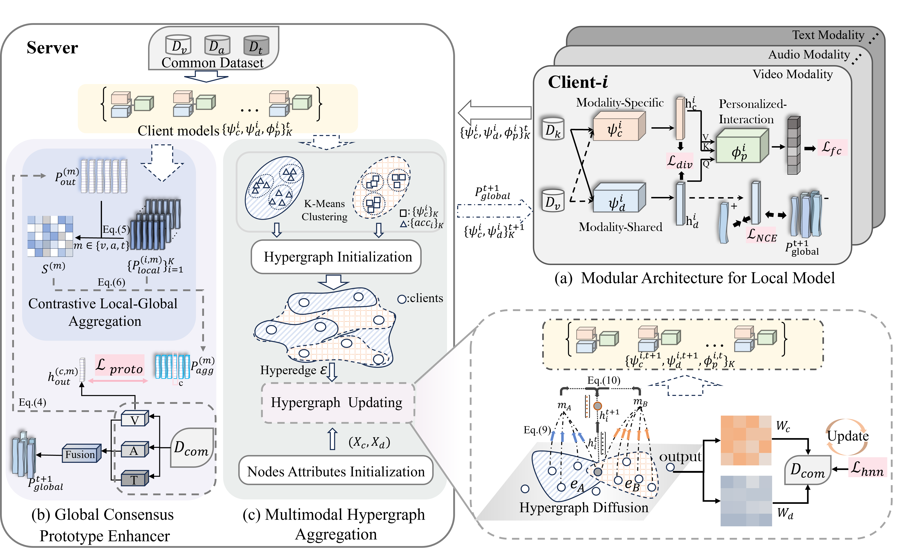

# HAMFED
# Hypergraph Aggregation for Modality Agnostic Federated Learning

<div align="center">
  
</div>
<p align="center"><em>The network architecture of the proposed framework. Client side: (a) Modular Architecture for Local Model. Server-side: (b) Global Consensus Prototype Enhancer and (c) Multimodal Hypergraph Aggregation.</em></p>

The download link for the paper is [here]().


## Environment
 We manage environments with Conda. To set up the environment, follow these steps:
```
pip install -r requirements.txt
```


## Preprocess dataset

The dataset for this project utilizes a Dirichlet parameter-based partitioning method to allocate client data. The data feature partitioning of the dataset are implemented in the /data. Before the project runs, feature extraction processing needs to be performed on the data in the dataset.

## Run the experiment
Before run the experiment, please make sure that the dataset is downloaded and preprocessed already.

```
python main.py
```


## Citing our work

The preprint can be cited as follows

```bibtex
@inproceedings{qi2024adaptive,
  title={Adaptive hyper-graph aggregation for modality-agnostic federated learning},
  author={Qi, Fan and Li, Shuai},
  booktitle={Proceedings of the IEEE/CVF Conference on Computer Vision and Pattern Recognition},
  pages={12312--12321},
  year={2024}
}
```
